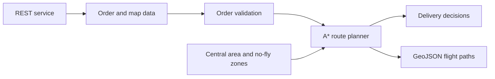

# PizzaDronz Route Planner

A Java route-planning project for autonomous pizza-delivery drones. It retrieves delivery data from a REST service, validates orders, plans routes around no-fly zones and exports the resulting flights as GeoJSON.

## What It Does

- Loads restaurants, menus, orders, the central area and no-fly zones from a REST service.
- Validates delivery orders before route planning.
- Uses A* search to calculate drone routes between Appleton Tower and restaurants.
- Supports 16 movement directions and checks whether coordinates enter polygonal no-fly zones.
- Uses a `PriorityQueue` for the A* open set and caches restaurant routes to avoid repeated planning.
- Produces GeoJSON files for deliveries and drone flight paths.

## Design Overview



The core pathfinding score is:

```text
F = G + H
```

- `G` represents the accumulated movement cost from the starting point.
- `H` estimates the remaining distance to the destination.
- The route planner prioritizes coordinates with the lowest estimated total cost.

## Main Components

| Component | Responsibility |
| --- | --- |
| `Main` | Application entry point, data initialization, order processing and output |
| `HttpClient` | REST data retrieval and JSON conversion |
| `AStar` | A* route-search implementation |
| `LngLat` | Coordinates, movement, distance and polygon-containment checks |
| `Restaurant` | Menu data, cached routes and GeoJSON flight paths |
| `Order` / `OrderOutcome` | Delivery-order data and validation results |
| `NoFlyZones` / `CentralArea` | Geographic constraints |
| `MoveDirection` | Supported drone movement directions |

## Repository Contents

- [`ilp-report.pdf`](ilp-report.pdf) - architecture, class design, A* explanation and optimization notes.
- [`PizzaDronz-1.0-SNAPSHOT.jar`](PizzaDronz-1.0-SNAPSHOT.jar) - packaged Java application.
- [`overview-tree.html`](overview-tree.html) and related files - generated Javadoc index assets.
- [`dependency-reduced-pom.xml`](dependency-reduced-pom.xml) - Maven dependency information from the packaged build.

## Technology

`Java` · `Maven` · `A* pathfinding` · `Jackson` · `Mapbox GeoJSON`

## Archive Note

This repository is an archival upload of the final 2022 coursework build. It contains the packaged application, report and generated documentation assets; the original Java source files were not included in this upload. The external coursework REST service may no longer be available, so the JAR is retained primarily as a record of the implementation.

